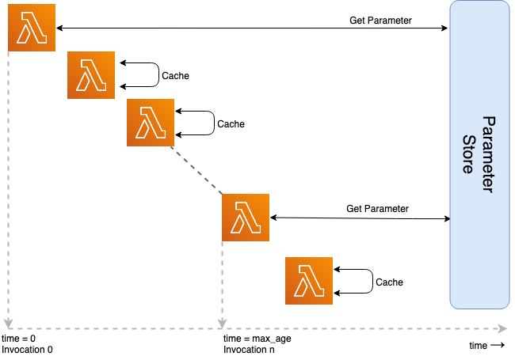

<h1 align="center"> Lambda Cache </h1>
<h2 align="center"> Simple Caching for AWS Lambda</h2>

    [](https://lambda-cache.readthedocs.io/en/latest/?badge=latest) [](https://lambda-cache.readthedocs.io/en/latest/?badge=latest)

 [](https://coveralls.io/github/keithrozario/lambda-cache?branch=release) [](https://github.com/psf/black) 

# Introduction

<p align="center"></p>

_lambda-cache_ helps you cache data in your Lambda function **across** invocations. The package utilizes the internal memory of the lambda function's [execution context](https://docs.aws.amazon.com/lambda/latest/dg/runtimes-context.html) to store data across multiple invocations. Doing this:

* Reduces load on back-end systems
* Reduces the execution time of the lambda
* Guarantees functions will reference latest data after cache expiry
* Reduces calls to APIs throttling limits or high charges

_lambda-cache_ prioritizes simplicity over performance and flexibility. 


The package is purpose-built for AWS Lambda functions, and currently supports SSM Parameters, Secrets from Secrets Manager and S3 Objects.


# Installation

Include the package in your functions code zip-file using the following:

    $ pip install lambda-cache -t /path/of/function

Refer to [docs](https://lambda-cache.readthedocs.io/en/latest/install/) for how to include into your lambda function.

# Usage

Below we describe further features of the package. For more info refer to the [user guide](https://lambda-cache.readthedocs.io/en/latest/user_guide/).

<!-- vscode-markdown-toc -->
* [SSM - Parameter Store](#SSM-ParameterStore)
	* [Cache single parameter](#Cachesingleparameter)
	* [Change cache expiry](#Changecacheexpiry)
	* [Change cache entry settings](#Changecacheentrysettings)
	* [Cache multiple parameters](#Cachemultipleparameters)
	* [Decorator stacking](#Decoratorstacking)
	* [Cache invalidation](#Cacheinvalidation)
	* [Return Values](#ReturnValues)
* [Secrets Manager](#SecretsManager)
	* [Cache single secret](#Cachesinglesecret)
	* [Change Cache expiry](#ChangeCacheexpiry)
	* [Change Cache entry settings](#ChangeCacheentrysettings)
	* [Decorator stacking](#Decoratorstacking-1)
	* [Cache Invalidation](#CacheInvalidation)
	* [Return Values](#ReturnValues-1)
* [S3](#S3)
	* [Cache a single file](#Cacheasinglefile)
	* [Change Cache expiry](#ChangeCacheexpiry-1)
	* [Check file before download](#Checkfilebeforedownload)

## <a name='SSM-ParameterStore'></a>SSM - Parameter Store

### <a name='Cachesingleparameter'></a>Cache single parameter

To cache a parameter from ssm, decorate your handler function like so:

```python
from lambda_cache import ssm

@ssm.cache(parameter='/production/app/var')
def handler(event, context):
    var = getattr(context,'var')
    response = do_something(var)
    return response
```
All invocations of this function over in the next minute will reference the parameter from the function's internal cache, rather than making a network call to ssm. After one minute has lapsed, the the next invocation will invoke `get_parameter` to refresh the cache. The parameter value will be injected into the `context` object of your lambda handler.

### <a name='Changecacheexpiry'></a>Change cache expiry

The default `max_age_in_seconds` settings is 60 seconds (1 minute), it defines the maximum age of a parameter that is acceptable to the handler function. Cache entries older than this, will be refreshed. To set a longer cache duration (e.g 5 minutes), change the setting like so:

```python
from lambda_cache import ssm

@ssm.cache(parameter='/production/app/var', max_age_in_seconds=300)
def handler(event, context):
    var = getattr(context,'var')
    response = do_something(var)
    return response
```

_Note: The caching logic runs only at invocation, regardless of how long the function runs. A 15 minute lambda function will not refresh the parameter, unless explicitly refreshed using `get_entry` method. The library is primary interested in caching 'across' invocation rather than 'within' an invocation_

### <a name='Changecacheentrysettings'></a>Change cache entry settings

The default name of the parameter is the string after the last slash('/') character of its name. This means `/production/app/var` and `test/app/var` both resolve to just `var`. To over-ride this default, use `entry_name` setting like so:

```python
from lambda_cache import ssm

@ssm.cache(parameter='/production/app/var', entry_name='new_var')
def handler(event, context):
    var = getattr(context,'new_var')
    response = do_something(var)
    return response
```

### <a name='Cachemultipleparameters'></a>Cache multiple parameters

To cache multiple entries at once, pass a list of parameters to the parameter argument. This method groups all the parameter value under one python dictionary, stored in the Lambda Context under the `entry_name`. 

_Note: When using this method, `entry_name` is a required parameter, if not present `NoEntryNameError` exception is thrown._

```python
from lambda_cache import ssm

@ssm.cache(parameter=['/app/var1', '/app/var2'], entry_name='parameters')
def handler(event, context):
    var1 = getattr(context,'parameters').get('var1')
    var2 = getattr(context,'parameters').get('var2')
    response = do_something(var)
    return response
```

Under the hood, we use the `get_parameters` API call for boto3, which translate to a single network call for multiple parameters. You can group all parameters types in a single call, including `String`, `StringList` and `SecureString`. `StringList` will return as a list, while all other types will return as plain-text strings. The library does not support returning `SecureString` parameters in encrypted form, and will only return plain-text strings regardless of String type.

_Note: for this method to work, ensure you have both `ssm:GetParameter` **and** `ssm:GetParameters` (with the 's' at the end) in your function's permission policy_

### <a name='Decoratorstacking'></a>Decorator stacking

If you wish to cache multiple parameters with different expiry times, stack the decorators. In this example, `var1` will be refreshed every 30 seconds, `var2` will be refreshed after 60.

```python
@ssm.cache(parameter='/production/app/var1', max_age_in_seconds=30)
@ssm.cache(parameter='/production/app/var2', max_age_in_seconds=60)
def handler(event, context):
    var1 = getattr(context,'var1')
    var2 = getattr(context,'var2')
    response = do_something(var)
    return response
```
_Note: Decorator stacking performs one API call per decorator, which might result is slower performance_

### <a name='Cacheinvalidation'></a>Cache invalidation

If you require a fresh value at some point of the code, you can force a refresh using the `ssm.get_entry` function, and setting the `max_age_in_seconds` argument to 0.

```python
from lambda_cache import ssm

@ssm.cache(parameter='/prod/var')
def handler(event, context):

    if event.get('refresh'):
        # refresh parameter
        var = ssm.get_entry(parameter='/prod/var', max_age_in_seconds=0)
    else:
        var = getattr(context,'var')
    
    response = do_something(var)
    return response
```

You may also use `ssm.get_entry` to get a parameter entry from anywhere in your functions code.

To only get parameter once in the lifetime of the function, set `max_age_in_seconds` to some arbitary large number ~36000 (10 hours).

### <a name='ReturnValues'></a>Return Values

Caching supports `String`, `SecureString` and `StringList` parameters with no change required (ensure you have `kms:Decrypt` permission for `SecureString`). For simplicity, `StringList` parameters are automatically converted into list (delimited by comma), while `String` and `SecureString` both return the single string value of the parameter.

## <a name='SecretsManager'></a>Secrets Manager

### <a name='Cachesinglesecret'></a>Cache single secret

Secret support is similar, but uses the `secret.cache` decorator.

```python
from lambda_cache import secret

@secret.cache(name='/prod/db/conn_string')
def handler(event, context):
    conn_string = getattr(context,'conn_string')
    return context
```


### <a name='ChangeCacheexpiry'></a>Change Cache expiry

The default `max_age_in_seconds` settings is 60 seconds (1 minute), it defines how long a parameter should be kept in cache before it is refreshed from ssm. To configure longer or shorter times, modify this argument like so:

```python
from lambda_cache import secret

@secret.cache(name='/prod/db/conn_string', max_age_in_seconds=300)
def handler(event, context):
    var = getattr(context,'conn_string')
    response = do_something(var)
    return response
```

_Note: The caching logic runs only at invocation, regardless of how long the function runs. A 15 minute lambda function will not refresh the parameter, unless explicitly refreshed using get_cache_ssm. The library is primary interested in caching 'across' invocation rather than 'within' an invocation_

### <a name='ChangeCacheentrysettings'></a>Change Cache entry settings

The name of the secret is simply shortened to the string after the last slash('/') character of the secret's name. This means `/prod/db/conn_string` and `/test/db/conn_string` resolve to just `conn_string`. To over-ride this default, use `entry_name`:

```python
from lambda_cache import secret

@secret.cache(name='/prod/db/conn_string', entry_name='new_var')
def handler(event, context):
    var = getattr(context,'new_var')
    response = do_something(var)
    return response
```

### <a name='Decoratorstacking-1'></a>Decorator stacking

If you wish to cache multiple secrets, you can use decorator stacking.

```python
@secret.cache(name='/prod/db/conn_string', max_age_in_seconds=30)
@secret.cache(name='/prod/app/elk_username_password', max_age_in_seconds=60)
def handler(event, context):
    var1 = getattr(context,'conn_string')
    var2 = getattr(context,'elk_username_password')
    response = do_something(var)
    return response
```

_Note: Decorator stacking performs one API call per decorator, which might result is slower performance._

### <a name='CacheInvalidation'></a>Cache Invalidation

To invalidate a secret, use the `get_entry`, setting the `max_age_in_seconds=0`.
```python
from lambda_cache import secret

@secret.cache(name='/prod/db/conn_string')
def handler(event, context):

    if event.get('refresh'):
        var = secret.get_entry(name='/prod/db/conn_string', max_age_in_seconds=0)
    else:
        var = getattr(context,'conn_string')
    response = do_something(var)
    return response
```

### <a name='ReturnValues-1'></a>Return Values

Secrets Manager supports both string and binary secrets. For simplicity we will cache the secret in the format it is stored. It is up to the calling application to process the return as Binary or Strings.

## <a name='S3'></a>S3

S3 support is considered _experimental_ for now, but withing the python community we see a lot of folks pull down files from S3 for use in AI/ML models.

Files downloaded from s3 are automatically stored in the `/tmp` directory of the lambda function. This is the only writable directory within lambda, and has a 512MB of storage space. 

### <a name='Cacheasinglefile'></a>Cache a single file
To download a file from S3 use the the same decorator pattern:

```python
from lambda_cache import s3

@s3.cache(s3Uri='s3://bucket_name/path/to/object.json')
def s3_download_entry_name(event, context):

    # Object from S3 automatically saved to /tmp directory
    with open("/tmp/object.json") as file_data:
        status = json.loads(file_data.read())['status']

    return status
```

### <a name='ChangeCacheexpiry-1'></a>Change Cache expiry

The default `max_age_in_seconds` settings is 60 seconds (1 minute), it defines how long a file should be kept in `/tmp` before it is refreshed from S3. To configure longer or shorter times, modify this argument like so:

```python
from lambda_cache import s3

@s3.cache(s3Uri='s3://bucket_name/path/to/object.json', max_age_in_seconds=300)
def s3_download_entry_name(event, context):
    with open("/tmp/object.json") as file_data:
        status = json.loads(file_data.read())['status']

    return status
```

_Note: The caching logic runs only at invocation, regardless of how long the function runs. A 15 minute lambda function will not refresh the object, unless explicitly refreshed using `s3.get_entry`. The library is primary interested in caching 'across' invocation rather than 'within' an invocation_

### <a name='Checkfilebeforedownload'></a>Check file before download

By default, _lambda_cache_ will download the file once at cache has expired, however, to save on network bandwidth (and possibly time), we can set the `check_before_download` parameter to True. This will check the age of the object in S3 and download **only** if the object has changed since the last download. 

```python
from lambda_cache import s3

@s3.cache(s3Uri='s3://bucket_name/path/to/object.json', max_age_in_seconds=300, check_before_download=True)
def s3_download_entry_name(event, context):
    with open("/tmp/object.json") as file_data:
        status = json.loads(file_data.read())['status']

    return status
```

_Note: we use the GetHead object call to verify the objects `last_modified_date`. This simplifies the IAM policy of the function, as it still only requires the `s3:GetObject` permission. However, this is still a GET requests, and will be charged as such, for smaller objects it might be cheaper to just download the object_

# Credit

Project inspired by:
* [SSM-Cache](https://github.com/alexcasalboni/ssm-cache-python)
* [middy](https://github.com/middyjs/middy)
